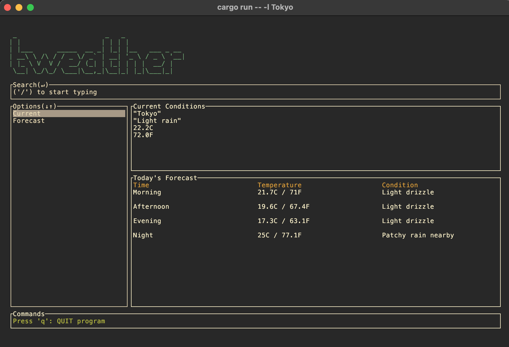

```
 _                      _   _               
| |                    | | | |              
| |___      _____  __ _| |_| |__   ___ _ __ 
| __\ \ /\ / / _ \/ _` | __| '_ \ / _ \ '__|
| |_ \ V  V /  __/ (_| | |_| | | |  __/ |   
 \__| \_/\_/ \___|\__,_|\__|_| |_|\___|_|                                           
                                            
```
## About
**t-weather** is a simple terminal based application to find the current and forecasted weather for locations all around the globe.

The project is implemented using the reqwest::**blocking** module, however wait time is minimized by retrieving all required data in single requests.  This ensures that we will only need to make a new request to the weather API when the location changes.

## Guide
In order to obtain an API key, you will need to register for a free account at [weatherapi.com](https://www.weatherapi.com/).

Once you have been granted a key, simply add it to your .env file and you're good to go!

## Examples

